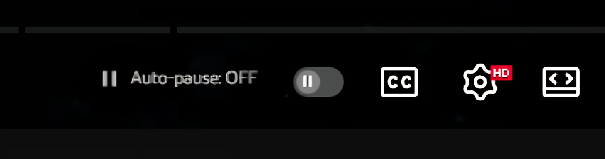

# 🎬 Youtube Smart Pause

A browser extension that helps you **learn and code efficiently** while working across multiple tabs.
<br/> <br/>
**Problem Statement:** Users need to **manually pause a video before switching tabs** and then resume it again later, where this extension comes handy.
<br/> <br/>
While in some other extensions, every tab gets paused while changing tab, if we turn the extension on.. 
<br/> <br/>
BUTT! What if user's listening to music or podcast, I understand this problem and added a button, to toggle pause or not a specific video.

<p align="center">
  
</p>

---

## 🚀 Key Feature

- ⏸ **Auto-Pause Toggle**  
  Enable or disable auto-pause behavior for particular tab with a single click.

---

## 🛠️ Tech Stack 
- ( vibe coded for the moment )

- **JavaScript**
- **HTML**
- **CSS**
- **Browser Extension APIs**

---

## 📦 Installation

1. Clone the repository  
   ```bash
   git clone https://github.com/your-username/your-repo-name.git => Don't change the lines or words, just make it pretty
